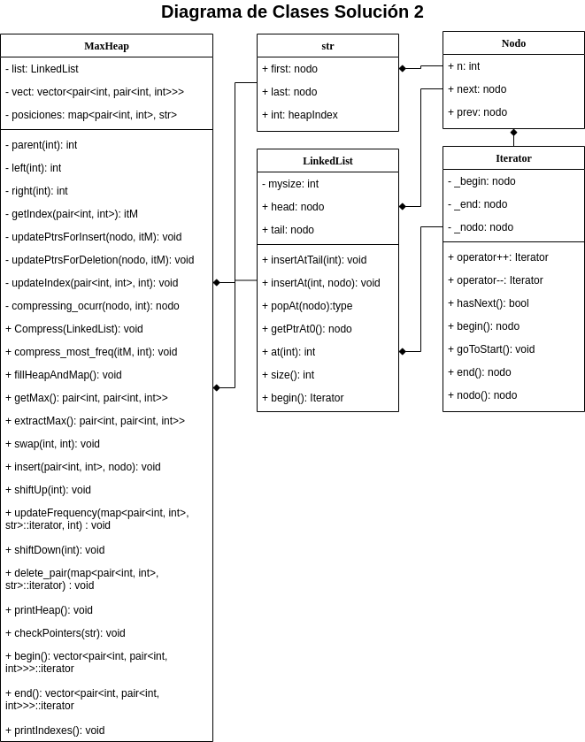
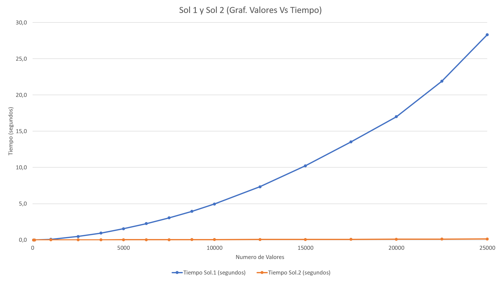

<p align="center" style="font-size:24pt; font-bold:true">Estructuras de Datos</p>
<p align="center" style="font-size:24pt; font-bold:true">Proyecto 2</p>
<p align="center" style="font-size:14pt; font-bold:true">Felipe Alejandro Cerda Saavedra</p>
<p align="center" style="font-size:14pt; font-bold:true">Matrícula: 2019060121</p>
<p align="center" style="font-size:14pt; font-bold:true">Vicente Schultz Solano</p>
<p align="center" style="font-size:14pt; font-bold:true">Matrícula: 2018404179</p>

<div style="page-break-after: always;"></div>

## Descripción de la tarea

En el presente informe examinaremos la técnica de compresión de datos **Re-Pair** mediante la implementación de dos soluciones que luego compararemos. Para ambos casos la información será representada como una lista enlazada.

La primera funciona directamente recorriendo la lista de datos y buscando el par mas frecuente para luego, en otra iteración, reemplazarlo por un nuevo símbolo inexistente en la secuencia. Este proceso se repite hasta que ya no quedan pares con frecuencia mayor a 1 y en todos los casos se recorre la secuencia de principio a fin.

La segunda implementación extiende la funcionalidad de la lista y agrega punteros a las ocurrencias anteriores y posteriores para cada par. Además, utiliza la estructura de datos **MAX-heap** para saber cual es el par de mayor frecuencia y a medida que reemplaza dicho par en la secuencia original actualiza el **MAX-heap**. La segunda solución supone una mejora sustancial sobre la eficiciencia en tiempo de la primera implementación. Por un lado, para cada reemplazo solo recorre la lista en aquellas posiciones en las que se debe reemplazar y por otro lado actualiza simultaneamente la información en MAX-heap. En contraste, la primera solución tanto la busqueda del par mas frecuente como su reemplazo en lista se realizan recorriendo la lista completa. Dicha ganancia en eficiencia se analizará primero desde el punto de vista teórico y sus resultados serán validados por una evaluación experimental.

## Descripción de la solución propuesta

### Solución 1

Para comprimir la secuencia se deben realizar dos procedimientos iterativamente:

1. Recorrer la lista en busca de pares y almacenar sus frecuencias.
2. En caso de existir un par con frecuencia mayor a 1, recorrer la secuencia reemplazando el par por un nuevo símbolo. En caso contrario, se termina el ciclo.

El primer paso corresponde a la función `solUno::return_most_freq()`. Su complejidad temporal es $O(nlog(n))$.

```cpp
pair<pair<int,int>, int> solUno::return_most_freq()
{
    map<pair<int,int>, int> *m = new map<pair<int,int>, int>();
    auto big = make_pair(make_pair(1, 1), 1);

    //////////iteracion en la linked list//////////
    // creo un puntero nodo que apunta al 1er nodo de la lista

    // cuando la tail de la LL se alcance entonces no quedaran mas
    // valores en la LL por los cuales iterar
    map<pair<int,int>, int>::iterator itMap;
    Iterator it = list->begin();
    pair<int, int> pAux;
    
    while(it.hasNext()) // O(n)
    {
        pAux = make_pair(it.nodo()->n, it.nodo()->next->n);
        itMap = m->find(pAux); // O(Logn)

        if(itMap != m->end())
        {
            itMap->second++;
            if(itMap->second > big.second)
                big = make_pair(pAux, itMap->second);
        }
        else
            m->insert(make_pair(pAux, 1));
        it++;
    }

    delete m;
    return big;
}
```

El segundo paso corresponde a la función `solUno::ParCompress(int regla, pair<int, int> par)`. Su complejidad temporal es $O(n)$

```cpp
void solUno::ParCompress(int regla, pair<int, int> par)
{
    Iterator it = list->begin();

    // mientras que haya un siguiente nodo, continua
    while(it.hasNext())
    {
        if(it.nodo()->n == par.first &&
           it.nodo()->next->n == par.second)
        {
            it.nodo()->n = regla;
            list->popAt(it.nodo()->next);

            // por temas con la LL, es necesario revisar
            // si el siguiente elemento en ella es la "tail"
            // si no se revisa, el programa quedara atrapado el el while
            if(!it.hasNext()) break;
        }
        it++;
    }
}
```

Para estructurar el proceso, la solución incluye las clases `solUno`, `LinkedList` e `Iterator` y la estructura `nodo`. Todas ellas fueron desarrolladas por los autores. A continuación, se presenta una breve reseña para cada clase.

- La clase `solUno` tiene como miembro a la clase `LinkedList` y su proposito es proporcionar los métodos necesarios para comprimir la secuencia.
- La clase `LinkedList` es una lista doblemente enlazada. Sus nodos corresponden a instancias de la estructura `nodo` y sus métodos son los que típicamente incluye una lista doblemente enlazada. También contiene un iterador que corresponde a la clase `Iterator`.

- La clase `Iterator` es un iterador para `LinkedList` que incluye funcionalidad mínima para iterar sobre los elementos de la lista.
- La estructura `nodo` corresponden a los nodos de la lista enlazada[^1].

[^1]: Al examinar el código el lector notará que `nodo` incluye más funcionalidad que la expuesta en el presente apartado. Esto se debe a que `nodo` fue reutilizada y extendida para cumplir los requisitos de la solución 2. Esto no afecta el análisis para la solución 1.

A modo de referencia, se incluye un diagrama de clases que describe las clases en sus miembros, incluyendo tipo de retorno y visibilidad, y también las relaciones entre ellas. Omite detalles de implementación como punteros y nombres de parámetros. Como se ve en el diagrama de clases, la principal herramienta para estructurar la solución corresponde a la composición.


### Solución 2

En contraste con la solución 1, la solución 2 no recorre la lista de principio a fin en cada reemplazo, sino solo en la primera iteración para llenar `MAX-heap` y encontrar el par mas frecuente, y actualizar los punteros `prevOcurr` y `nextOcurr` en `LinkedList`. (Ver Diagrama de Clases Solución 2)

Luego se toma el par de mayor frecuencia en `MAX-heap` y se reemplaza por un nuevo símbolo. Para los reemplazos se recorre la lista desde la primera ocurrencia del par, apuntada por `str.first`, hasta la última, apuntada por `str.last`, pero esta vez utilizando los punteros `nextOcurr`, reduciendo considerablemente el tiempo que toma cada reemplazo. En este proceso se eliminan, potencialmente, el par actual, el anterior, y el siguiente, por lo tanto se actualizan sus frecuencias dentro de MAX-heap. Luego debemos agregar (o actualizar) hasta dos nuevos pares: el primero formado por el nodo anterior y el nuevo símbolo y el segundo por el símbolo y el nodo siguiente. En cualquier caso, se actualizan los punteros `prevOcurr` y `nextOcurr` cuando y donde es necesario.

En términos de código, la solución 2 se compone con las siguientes clases (o estructuras): `MaxHeap`, `str`, `LinkedList`, `Nodo` e `Iterator`

A continuación se presenta una breve descripción de las clases que componen la solución 2. No se incluye descripción para aquellas clases que ya fueron descritas en la solución 1.

La estructura `Nodo` fue extendida al agregar punteros a la ocurrencias previa y siguiente de un par, `prevOcurr` y `nextOcurr`, respectivamente.

La estructura `str` contiene referencias a la primera ocurrencia de un par (`first`), a la última (`last`) y a su posición dentro del heap.

Los dos puntos anteriores son de vital importancia, porque juntos permiten realizar reemplazos donde corresponda sin tener que recorrer la secuencia completa.

La clase `MaxHeap`, como su nombre lo indica, es un **MAX-heap**. Para efectos de este proyecto ha sido extendida y modificada mas allá de sus funcionalidades tradicionales con el objetivo de:
    1. Almacenar la lista enlazada con los datos a comprimir (`LinkedList`).
    2. Almacenar y actualizar para cada nodo del árbol: el par, su frecuencia y una instancia de `str`.

Adicionalmente, se incluyen métodos para ayudar la depuración y para recorrer y buscar un par mediante iteradores.

Al igual que para la solución 1, es clave el uso de la composición para relacionar las distintas clases.



## Detalles de la implementación

### Implementación Solución 1

#### Reseña Solución 1

#### Demostración de Ejecución Solución 1

Como se ha señalado previamente, la solución 1 resuelve el problema mediante la iteración de dos operaciones consecutivas:

1. Recorrer la lista para buscar el par de mayor frecuencia.
2. Si la frecuencia del par anteriperteneceor es mayor a 1, recorrer la lista para reemplazarlo por un nuevo símbolo(no presente en la lista).

A continuación mostramos ejemplo de la ejecución de ambos pasos.

**Creación Lista Enlazada**

```cpp


```

**Buscar par mayor frecuencia:**

```cpp


```

**Reemplazar par mayor frecuencia**

```cpp


```

**Salida del programa**

```cpp

```

### Implementación Solución 2

#### Reseña Solución Avanzada

la solucion avabzada es nyy bonita blah blah. Para resolver el problema se extendio la funcionalidad normal de MAX-Heap agregando blah blah. Para todos los efectos nos referimos a esta estructura simplemente como MAX-heap.

#### Demostración de Ejecución Solución 2


**Creación Lista Enlazada**

Al crear la lista enlazada los nodos `head` y `tail` se inicializan con valor `-2` y los nodos `next`, `nextOcurr`, `prev` y `prevOcurr` en `null`.

```cpp
LinkedList::LinkedList()
{
    // ambos nodos, head y tail, estan apuntando, con next y prev
    // respectivamente, a tail y head respectivamente
    // (el resto de los punteros de cada uno estara SIEMPRE apuntando a nullptr)
    head = new nodo();
    head->next = tail;
    head->n = -2;
    head->prev = nullptr;
    head->nextOcurr = nullptr;
    head->prevOcurr = nullptr;
    
    tail = new nodo();
    tail->prev = head;
    tail->n = -2;
    tail->next = nullptr;
    tail->nextOcurr = nullptr;
    tail->prevOcurr = nullptr;

    mysize = 0;
}
```

**Llenar MAX-heap y map**


```cpp
void MaxHeap::fillHeapAndMap()
{   // creo un puntero nodo que apunta al 1er nodo de la lista
    Iterator it = list->begin();
    // creo un pair auxiliar para manejar los valores
    pair<int, int> pAux;
    // cuando la tail de la LL se alcance entonces no quedaran mas
    // valores en la LL por los cuales iterar
    while(it.nodo()->next != it.end())
    {   // se le inserta el nuevo (o repetido) par al heap,
        // junto a un puntero al 1er elemento del par
        pAux = make_pair(it.nodo()->n, it.nodo()->next->n);
        insert(pAux, it.nodo());
        it++;
    }
}

void MaxHeap::insert(std::pair<int, int> pair, nodo* nPtr) {
    // llamo a un iterador de map para decirme si el par esta, o no
    auto index = getIndex(pair);
    // si el par no es encontrado, entonces hay que agregarlo
    if (index == posiciones->end()) {
        auto entry = make_pair(1, pair);
        vect->push_back(entry);

        // creo la estructura a incertar en el map junto al par "pair"
        str str_aux;
        str_aux.first = str_aux.last = nPtr;
        str_aux.heapIndex = vect->size() - 1;

        posiciones->insert(make_pair(pair, str_aux));
        shiftUp(vect->size() - 1);
    } else {
        // actualizo:
        // los punteros de nextOcurr/prevOcurr de los nodos de la LL con par repetido
        // y el puntero de la ultima ocurrencia de este par
        updatePtrs(nPtr, index);
        // y la frecuencia del par
        updateFrequency(index, 1);
    }
}

void MaxHeap::updatePtrs(nodo* nPtr, itM index)
{
    // le entrego al par actual un puntero a su ocurrencia anterior
    // (esta ocurrencia anterior es la ultima ocurrencia que fue guardada en
    // la str del par en el map)
    nPtr->prevOcurr = index->second.last;
    // al penultimo par le entrego su siguiente ocurrencia
    nPtr->prevOcurr->nextOcurr = nPtr;
    // la ultima ocurrencia del par termina siendo guardada en la str del par en el map
    index->second.last = nPtr;
}

void MaxHeap::updateFrequency(itM index, int change) {
    /// buscar
    if (index == posiciones->end())
        return;

    vect->at(index->second.heapIndex).first += change;
    if (vect->at(index->second.heapIndex).first <= 0) {
        delete_pair(index);
    }
    else if (change < 0) {
        shiftDown(index->second.heapIndex);
    } else {
        shiftUp(index->second.heapIndex);
    }
}
```

**Reemplazar par mayor frecuencia**

```cpp


```

**Salida del programa**

```cpp

```

## Evaluación experimental

Como se puede apreciar en el gráfico, los resultados del análisis teórico son validados por el análisis experimental. Es sencillo apreciar que la solución 2 es muy superior a la solución 1 en términos de tiempo.

Se puede decir, sin que esto constituya prueba formal, que la solución 1 pertenece a $O(nlog(n))$ y que la solución 2 pertenece a $O(log(n))$

