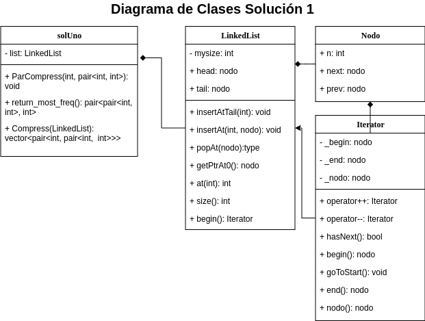

<p align="center" style="font-size:24pt; font-bold:true">Estructuras de Datos</p>
<p align="center" style="font-size:24pt; font-bold:true">Proyecto 2</p>
<p align="center" style="font-size:14pt; font-bold:true">Felipe Alejandro Cerda Saavedra</p>
<p align="center" style="font-size:14pt; font-bold:true">Matrícula: 2019060121</p>
<p align="center" style="font-size:14pt; font-bold:true">Vicente Schultz Solano</p>
<p align="center" style="font-size:14pt; font-bold:true">Matrícula: 2018404179</p>

<div style="page-break-after: always;"></div>

## Descripción de la tarea

En el presente informe examinaremos la técnica de compresión de datos **Re-Pair** mediante la implementación de dos soluciones que luego compararemos. Para ambos casos la información será representada como una lista enlazada.

La primera funciona directamente recorriendo la lista de datos y buscando el par mas frecuente para luego, en otra iteración, reemplazarlo por un nuevo símbolo inexistente en la secuencia. Este proceso se repite hasta que ya no quedan pares con frecuencia mayor a 1 y en todos los casos se recorre la secuencia de principio a fin.

La segunda implementación extiende la funcionalidad de la lista y agrega punteros a las ocurrencias anteriores y posteriores para cada par. Además, utiliza la estructura de datos **MAX-heap** para saber cual es el par de mayor frecuencia y a medida que reemplaza dicho par en la secuencia original actualiza el **MAX-heap**. La segunda solución supone una mejora sustancial sobre la eficiciencia en tiempo de la primera implementación. Por un lado, para cada reemplazo solo recorre la lista en aquellas posiciones en las que se debe reemplazar y por otro lado actualiza simultaneamente la información en MAX-heap. En contraste, la primera solución tanto la busqueda del par mas frecuente como su reemplazo en lista se realizan recorriendo la lista completa. Dicha ganancia en eficiencia se analizará primero desde el punto de vista teórico y sus resultados serán validados por una evaluación experimental.

## Descripción de la solución propuesta

### Solución 1

Para comprimir la secuencia se deben realizar dos procedimientos iterativamente:

1. Recorrer la lista en busca de pares y almacenar sus frecuencias.
2. En caso de existir un par con frecuencia mayor a 1, recorrer la secuencia reemplazando el par por un nuevo símbolo. En caso contrario, se termina el ciclo.

Para estructurar el proceso, la solución incluye las clases `solUno`, `LinkedList` e `Iterator` y la estructura `nodo`. Todas ellas fueron desarrolladas por los autores. A continúación, se presenta una breve reseña para cada clase.

- La clase `solUno` tiene como miembro a la clase `LinkedList` y su proposito es proporcionar los métodos necesarios para comprimir la secuencia.
- La clase `LinkedList` es una lista doblemente enlazada. Sus nodos corresponden a instancias de la estructura `nodo` y sus métodos son los que típicamente incluye una lista doblemente enlazada. También contiene un iterador que corresponde a la clase `Iterator`.

- La clase `Iterator` es un iterador para `LinkedList` que incluye funcionalidad mínima para iterar sobre los elementos de la lista.
- La estructura `nodo` corresponden a los nodos de la lista enlazada[^1].

[^1]: Al examinar el código el lector notará que `nodo` incluye más funcionalidad que la expuesta en el presente apartado. Esto se debe a que `nodo` fue reutilizada y extendida para cumplir los requisitos de la solución 2. Esto no afecta el análisis para la solución 1.

A modo de referencia, se incluye un diagrama de clases que describe las clases en sus miembros, incluyendo tipo de retorno y visibilidad, y también las relaciones entre ellas. Omite detalles de implementación como punteros y nombres de parámetros. Como se ve en el diagrama de clases, la principal herramienta para estructurar la solución corresponde a la composición.



### Solución 2

En contraste con la solución 1, la solución 2 no recorre la lista de principio a fin en cada reemplazo, sino solo en la primera iteración para llenar `MAX-heap` y encontrar el par mas frecuente, y actualizar los punteros `prevOcurr` y `nextOcurr` en `LinkedList`. (Ver Diagrama de Clases Solución 2)

Luego se toma el par de mayor frecuencia en `MAX-heap` y se reemplaza por un nuevo símbolo. Para los reemplazos se recorre la lista desde la primera ocurrencia del par, apuntada por `str.first`, hasta la última, apuntada por `str.last`, pero esta vez utilizando los punteros `nextOcurr`, reduciendo considerablemente el tiempo que toma cada reemplazo. En este proceso se eliminan, potencialmente, el par actual, el anterior, y el siguiente, por lo tanto se actualizan sus frecuencias dentro de MAX-heap. Luego debemos agregar (o actualizar) hasta dos nuevos pares: el primero formado por el nodo anterior y el nuevo símbolo y el segundo por el símbolo y el nodo siguiente. En cualquier caso, se actualizan los punteros `prevOcurr` y `nextOcurr` cuando y donde es necesario.

En términos de código, la solución 2 se compone con las siguientes clases (o estructuras): `MaxHeap`, `str`, `LinkedList`, `Nodo` e `Iterator`

A continúación se presenta una breve descripción de las clases que componen la solución 2. No se incluye descripción para aquellas clases que ya fueron descritas en la solución 1.

La estructura `Nodo` fue extendida al agregar punteros a la ocurrencias previa y siguiente de un par, `prevOcurr` y `nextOcurr`, respectivamente.

La estructura `str` contiene referencias a la primera ocurrencia de un par (`first`), a la última (`last`) y a su posición dentro del heap.

Los dos puntos anteriores son de vital importancia, porque juntos permiten realizar reemplazos donde corresponda sin tener que recorrer la secuencia completa.

La clase `MaxHeap`, como su nombre lo indica, es un **MAX-heap**. Para efectos de este proyecto ha sido extendida y modificada mas allá de sus funcionalidades tradicionales con el objetivo de:
    1. Almacenar la lista enlazada con los datos a comprimir (`LinkedList`).
    2. Almacenar y actualizar para cada nodo del árbol: el par, su frecuencia y una instancia de `str`.

Adicionalmente, se incluyen métodos para ayudar la depuración y para recorrer y buscar un par mediante iteradores.

Al igual que para la solución 1, es clave el uso de la composición para relacionar las distintas clases.


## Detalles de la implementación

### Implementación Solución 1

Reconsideremos los pasos vistos anteriormente:

1. Recorrer la lista en busca de pares y almacenar sus frecuencias.
2. En caso de existir un par con frecuencia mayor a 1, recorrer la secuencia reemplazando el par por un nuevo símbolo. En caso contrario, se termina el ciclo.

El primer paso corresponde a la función `solUno::return_most_freq()`. Su complejidad temporal es $O(nlog(n))$.

```cpp
pair<pair<int,int>, int> solUno::return_most_freq()
{
    map<pair<int,int>, int> *m = new map<pair<int,int>, int>();
    auto big = make_pair(make_pair(1, 1), 1);

    //////////iteracion en la linked list//////////
    // creo un puntero nodo que apunta al 1er nodo de la lista

    // cuando la tail de la LL se alcance entonces no quedarán mas
    // valores en la LL por los cuales iterar
    map<pair<int,int>, int>::iterator itMap;
    Iterator it = list->begin();
    pair<int, int> pAux;
    
    while(it.hasNext()) // O(n)
    {
        pAux = make_pair(it.nodo()->n, it.nodo()->next->n);
        itMap = m->find(pAux); // O(Logn)

        if(itMap != m->end())
        {
            itMap->second++;
            if(itMap->second > big.second)
                big = make_pair(pAux, itMap->second);
        }
        else
            m->insert(make_pair(pAux, 1));
        it++;
    }

    delete m;
    return big;
}
```

El segundo paso corresponde a la función `solUno::ParCompress(int regla, pair<int, int> par)`. Su complejidad temporal es $O(n)$

```cpp
void solUno::ParCompress(int regla, pair<int, int> par)
{
    Iterator it = list->begin();

    // mientras que haya un siguiente nodo, continúa
    while(it.hasNext())
    {
        if(it.nodo()->n == par.first &&
           it.nodo()->next->n == par.second)
        {
            it.nodo()->n = regla;
            list->popAt(it.nodo()->next);

            // por temas con la LL, es necesario revisar
            // si el siguiente elemento en ella es la "tail"
            // si no se revisa, el programa quedará atrapado el el while
            if(!it.hasNext()) break;
        }
        it++;
    }
}
```

Como la primera función domina asintoticamente a la segunda, decimos que la solución 1 está en $O(nlog(n))$.


### Implementación Solución 2

Veamos un ejemplo de como se van actualizando los punteros de la LinkedList y de las estructuras del Map que apuntan a las primeras ocurrencias de cada par y a las últimas ocurrencias de esos mismos pares:

Glozario:
Negro (lapiz mina):
simboliza los nodos de la LinkedList y a las conecciones que van de nodo a nodo.

Rojo: 
simboliza punteros de `nextOcurr` y `prevOcurr`.
Si un nodo solo tiene un NULL, significa que sus punteros `nextOcurr` y `prevOcurr` estan ambos apuntanto a nullptr.
`nextOcurr` y `prevOcurr` se ven simbolizados por conexiones rojas a la izquierda y a la derecha. Y, 
si esa conexión tiene un NULL entonces esa ocurrencia no tiene una ocurrencia anterior o siguiente.

Verde:i
simboliza los punteroa de las estructuras que se encuentran en el Map.
Si apuntan a un NULL entonces, en ese momento, ese par no tiene ninguna ocurrencia en la LinkedList.
Si apuntan a un solo nodo, entonces solo tienen esa única ocurrencia de par en la LinkedList y,
si tienen un numero encerrado en verde, eso también simboliza ocurrencia única de par en la LinkedList.
Si apuntan a dos nodos distintos, entonces tienen 2 o mas ocurrencias de ese par en la LinkedList.

Ejemplo grafico de la LinkedList y sus punteros


Después de ejecutar "prepair_ptrs_for_compression", por primera vez, la lista anterior queda de la siguiente forma:


La mayoría de los punteros a estructuras siguen iguales. A excepción de los pares {2, 7} y {1, 3}.

El {2, 7} va a dejar de tener su única ocurrencia por lo que los punteros de su estructura en el Map ahora apuntaran a nullptrs.

Y el {1, 3} ahora tendrá a su segunda ocurrencia como su siguiente ocurrencia, su primera ocurrencia dejará de estar en la cadena de ocurrencias, el  puntero nextOcurr de su primera ocurrencia pasará a ser un nullptr y el puntero prevOcurr de su segunda ocurrencia pasará a ser un nullptr.

Ahora "compressing_ocurr" se ejecutará, dejando a la lista de la siguiente forma:


El nodo que seguía después del nodo que contenía al valor 7 fue eliminado.
Y el nodo que contenía al 7 fue intercambiado por la regla 28 de compresión.
Se agregaron dos pares nuevos al Map y al Heap. El par {2, 28} y el {28, 3}.

"prepair_ptrs_for_compression" se ejecuta por segunda vez y la lista queda de la siguiente forma:


La mayoría de los punteros a estructuras siguen iguales. A excepción de los pares {5, 7} y {1, 3}.

El {5, 7} va a dejar de tener su única ocurrencia por lo que los punteros de su estructura en el Map ahora apuntaran a nullptrs.

Y el {1, 3} ahora tendrá a su segunda ocurrencia como su única ocurrencia, su primera ocurrencia dejará de estar en la cadena de ocurrencia, el puntero nextOcurr de su primera ocurrencia pasará a ser un nullptr y el puntero prevOcurr de su segunda ocurrencia (ahora última ocurrencia) pasará a ser un nullptr.

"compressing_ocurr" se ejecutará por segunda vez, dejando a la lista de la siguiente forma:


El nodo que seguía después del nodo que contenía al valor 7 fue eliminado.
Y el nodo que contenía al 7 fue intercambiado por la regla 28 de compresion.
Se agregó el par {5, 28} al Map y al Heap. Y la frecuencia del par {28, 3} se vió aumentada en 1.

"prepair_ptrs_for_compression" y "compressing_ocurr" se ejecutan ambos por tercera vez, dejando a la LinkedList de la siguiente forma:


El nodo que seguía después del nodo que contenía al valor 7 fue eliminado.
Y el nodo que contenía al 7 fue intercambiado por la regla 28 de compresion.
Se agregó el par {4, 28} al Map y al Heap. Y la frecuencia del par {28, 3} se vió aumentada en 1.

Como se acabaron las ocurrencias del par {7, 3}, se continúa con el par {28, 3} ya que es el de mayor frecuencia y así hasta que todos los pares tengan frecuencia 1. Para ese punto, la LinkedList quedará de la siguiente forma:


## Evaluación experimental

Como se puede apreciar en el gráfico, los resultados del análisis teórico son insuficientes para elegir un método por sobre otro. Se ve claramente que la solución 2 es muy superior a la solución 1 en términos de tiempo.

Para clarificar el asunto, debemos tomar en cuenta otra variable distinta de `n`. Consideremos `p`  como el número de pares en la secuencia cuya frecuencia es mayor a 1. 

Así, en la primera solución consideremos el método `Compress` que tiene un ciclo `while` que depende de `p` y que en su interior llama a `return_most_freq` con complejidad $O(nlog(n))$. Si consideramos ambas variables, la complejidad está dada por $O(p*n*log(n))$.

```cpp
void solUno::Compress(LinkedList *l)
{
    list = l;
    int rule = 28;
    if(list->size() < 2)
    {
        cout
        << "no hay suficientes elementos para intentar comprimir, o "
        << "ejecutaste sUno primero que addSequence."
        << endl;
        return;
    }

    // mientras que la frecuencia del par mas repetido sea distinto de 1, continua
    auto replace = return_most_freq();
    while(replace.second != 1)
    {
        ParCompress(rule, replace.first); // O(n)

        // Buscar y cambiar el par encontrado por la rule 28, 29, ..., [rule]
        replace = return_most_freq(); // O(n*logn)

        // cout << replace.first.first << " " << replace.first.second << ", " << replace.second << endl;

        rule++;
    }
    return;
}

pair<pair<int,int>, int> solUno::return_most_freq()
{
    map<pair<int,int>, int> *m = new map<pair<int,int>, int>();
    auto big = make_pair(make_pair(1, 1), 1);

    //////////iteracion en la linked list//////////
    // creo un puntero nodo que apunta al 1er nodo de la lista

    // cuando la tail de la LL se alcance entonces no quedarán mas
    // valores en la LL por los cuales iterar
    map<pair<int,int>, int>::iterator itMap;
    Iterator it = list->begin();
    pair<int, int> pAux;
    
    while(it.hasNext()) // O(n)
    {
        pAux = make_pair(it.nodo()->n, it.nodo()->next->n);
        itMap = m->find(pAux); // O(Logn)

        if(itMap != m->end())
        {
            itMap->second++;
            if(itMap->second > big.second)
                big = make_pair(pAux, itMap->second);
        }
        else
            m->insert(make_pair(pAux, 1));
        it++;
    }

    delete m;
    return big;
}

```

En tanto, para la segunda solución consideramos el método `Compress` que contiene un ciclo `while` que depende de `p`. Este ciclo contiene la función `getIndex` que tiene complejidad $O(log(n))$ y domina asintóticamente a las otras funciones. Así, en función de `p` y `n` la complejidad está dada por $O(p*log(n))$.

```cpp
void MaxHeap::Compress(LinkedList *l)
{
    list = l;
    int rule = 28;
    if(list->size() < 2)
    {
        cout
        << "no hay suficientes elementos para intentar comprimir, o "
        << "ejecutaste sDos primero que addSequence."
        << endl;
        return;
    }

    fillHeapAndMap();

    // HASTA AQUI, EL MAP, EL HEAP Y LOS PUNTEROS PREVOCURR Y NEXTOCURR DE LOS NODOS
    // DE LA LL ESTAN TODOS INICIADOS CORRECTAMENTE.
    // AHORA INICIA EL PROCESO DE COMPRESION REAL.

    // hasta que el par en la raiz del heap no sea igual a 1, continua comprimiendo
    pair<int, pair<int, int>> auxPair;
    itM maxInMap;
    while(true)
    {   // reviso en el heap cual es el par de mayor frecuencia
        auxPair = getMax();

        // si la frecuencia del par es igual a 1, termina la compresion
        if(auxPair.first == 1) break;

        // en el map, busco el par de mayor frecuencia
        maxInMap = getIndex(auxPair.second);

        // utilizando los punteros en la struct del par (maxInMap)
        // actualizo los ptrs correspondientes
        // y comprimo el par
        compress_most_Freq(maxInMap, rule);
        rule++;
    }
}
```

En virtud de lo anterior, los resultados del análisis experimental son comprensibles.

