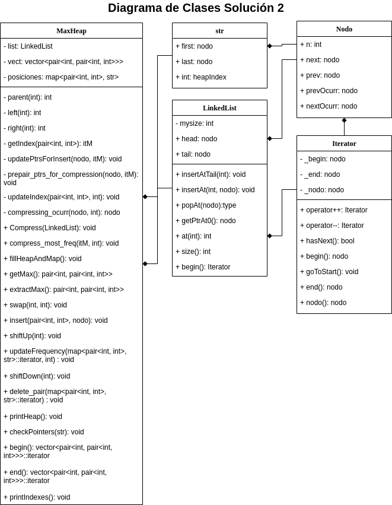

<p align="center" style="font-size:24pt; font-bold:true">Estructuras de Datos</p>
<p align="center" style="font-size:24pt; font-bold:true">Proyecto 2</p>
<p align="center" style="font-size:14pt; font-bold:true">Felipe Alejandro Cerda Saavedra</p>
<p align="center" style="font-size:14pt; font-bold:true">Matrícula: 2019060121</p>
<p align="center" style="font-size:14pt; font-bold:true">Vicente Schultz Solano</p>
<p align="center" style="font-size:14pt; font-bold:true">Matrícula: 2018404179</p>

<div style="page-break-after: always;"></div>

## Descripción de la tarea

En el presente informe examinaremos la técnica de compresión de datos **Re-Pair** mediante la implementación de dos soluciones que luego compararemos. Para ambos casos la información será representada como una lista enlazada.

La primera funciona directamente recorriendo la lista de datos y buscando el par mas frecuente para luego, en otra iteración, reemplazarlo por un nuevo símbolo inexistente en la secuencia. Este proceso se repite hasta que ya no quedan pares con frecuencia mayor a 1 y en todos los casos se recorre la secuencia de principio a fin. La segunda implementación extiende la funcionalidad de la lista y agrega punteros a las ocurrencias anteriores y posteriores para cada par. Además, utiliza la estructura de datos **MAX-heap** para saber cual es el par de mayor frecuencia y a medida que reemplaza dicho par en la secuencia original actualiza el **MAX-heap**. La segunda solución supone una mejora sustancial sobre la eficiciencia tiempo de la primera implementación. Por una lado, para cada reemplazo solo recorre la lista en aquellas posiciones en las que se debe reemplazar y por otro lado actualiza la información en MAX-heap al mismo tiempo. En la primera solución tanto la busqueda del par mas frecuente como su reemplazo en lista se realizan recorriendo la lista completa. Dicha ganancia en eficiencia se analizará primero desde el punto de vista teórico y sus resultados serán validados por una evaluación experimental.

## Descripción de la solución propuesta

### Solución 1

#### Diagrama de Clase Solucion 1


### Solución 2

#### Diagrama de Clase Solucion 2



## Detalles de la implementación

### Implementación Solución 1

#### Reseña Solución 1

#### Demostración de Ejecución Solución 1

Como se ha señalado previamente, la solución 1 resuelve el problema mediante la iteración de dos operaciones consecutivas:

1. Recorrer la lista para buscar el par de mayor frecuencia.
2. Si la frecuencia del par anterior es mayor a 1, recorrer la lista para reemplazarlo por un nuevo símbolo(no presente en la lista).

A continuación mostramos ejemplo de la ejecución de ambos pasos.

**Creación Lista Enlazada**

```cpp


```

**Buscar par mayor frecuencia:**

```cpp


```

**Reemplazar par mayor frecuencia**

```cpp


```

**Salida del programa**

```cpp

```

### Implementación Solución 2

#### Reseña Solución Avanzada

la solucion avabzada es nyy bonita blah blah. Para resolver el problema se extendio la funcionalidad normal de MAX-Heap agregando blah blah. Para todos los efectos nos referimos a esta estructura simplemente como MAX-heap.

#### Demostración de Ejecución Solución 2


**Creación Lista Enlazada**

Al crear la lista enlazada los nodos `head` y `tail` se inicializan con valor `-2` y los nodos `next`, `nextOcurr`, `prev` y `prevOcurr` en `null`.

```cpp
LinkedList::LinkedList()
{
    // ambos nodos, head y tail, estan apuntando, con next y prev
    // respectivamente, a tail y head respectivamente
    // (el resto de los punteros de cada uno estara SIEMPRE apuntando a nullptr)
    head = new nodo();
    head->next = tail;
    head->n = -2;
    head->prev = nullptr;
    head->nextOcurr = nullptr;
    head->prevOcurr = nullptr;
    
    tail = new nodo();
    tail->prev = head;
    tail->n = -2;
    tail->next = nullptr;
    tail->nextOcurr = nullptr;
    tail->prevOcurr = nullptr;

    mysize = 0;
}
```

**Llenar MAX-heap y map**


```cpp
void MaxHeap::fillHeapAndMap()
{   // creo un puntero nodo que apunta al 1er nodo de la lista
    Iterator it = list->begin();
    // creo un pair auxiliar para manejar los valores
    pair<int, int> pAux;
    // cuando la tail de la LL se alcance entonces no quedaran mas
    // valores en la LL por los cuales iterar
    while(it.nodo()->next != it.end())
    {   // se le inserta el nuevo (o repetido) par al heap,
        // junto a un puntero al 1er elemento del par
        pAux = make_pair(it.nodo()->n, it.nodo()->next->n);
        insert(pAux, it.nodo());
        it++;
    }
}

void MaxHeap::insert(std::pair<int, int> pair, nodo* nPtr) {
    // llamo a un iterador de map para decirme si el par esta, o no
    auto index = getIndex(pair);
    // si el par no es encontrado, entonces hay que agregarlo
    if (index == posiciones->end()) {
        auto entry = make_pair(1, pair);
        vect->push_back(entry);

        // creo la estructura a incertar en el map junto al par "pair"
        str str_aux;
        str_aux.first = str_aux.last = nPtr;
        str_aux.heapIndex = vect->size() - 1;

        posiciones->insert(make_pair(pair, str_aux));
        shiftUp(vect->size() - 1);
    } else {
        // actualizo:
        // los punteros de nextOcurr/prevOcurr de los nodos de la LL con par repetido
        // y el puntero de la ultima ocurrencia de este par
        updatePtrs(nPtr, index);
        // y la frecuencia del par
        updateFrequency(index, 1);
    }
}

void MaxHeap::updatePtrs(nodo* nPtr, itM index)
{
    // le entrego al par actual un puntero a su ocurrencia anterior
    // (esta ocurrencia anterior es la ultima ocurrencia que fue guardada en
    // la str del par en el map)
    nPtr->prevOcurr = index->second.last;
    // al penultimo par le entrego su siguiente ocurrencia
    nPtr->prevOcurr->nextOcurr = nPtr;
    // la ultima ocurrencia del par termina siendo guardada en la str del par en el map
    index->second.last = nPtr;
}

void MaxHeap::updateFrequency(itM index, int change) {
    /// buscar
    if (index == posiciones->end())
        return;

    vect->at(index->second.heapIndex).first += change;
    if (vect->at(index->second.heapIndex).first <= 0) {
        delete_pair(index);
    }
    else if (change < 0) {
        shiftDown(index->second.heapIndex);
    } else {
        shiftUp(index->second.heapIndex);
    }
}
```

**Reemplazar par mayor frecuencia**

```cpp


```

**Salida del programa**

```cpp

```


detalles de implementación (debe incluir un ejemplo
completo con al menos 3 pasos donde se vea cómo se van actualizando los punteros y estructuras
de datos, para la versión avanzada).

## Evaluación experimental


## Anexos